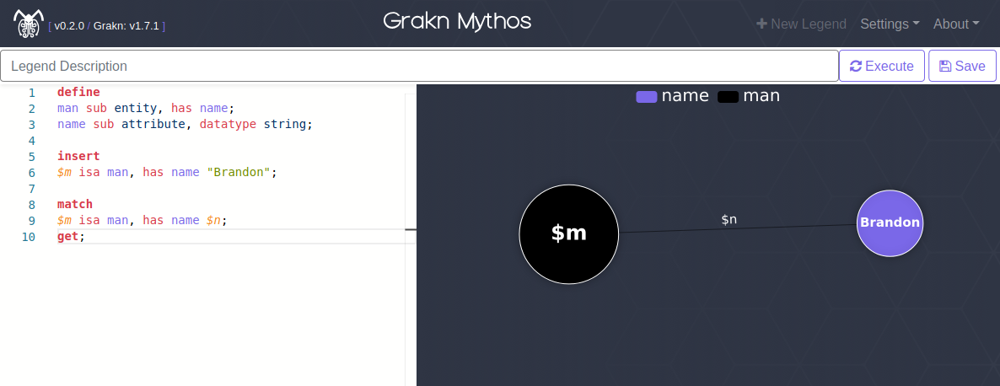

## Description

Grakn Mythos (mythos) is a Grakn-powered application for creating and sharing knowledge graphs. Using mythos you can create a place for you and your team to share related graphs (executing queries on shared keyspaces). Alternatively, you can share unrelated graphs (executing queries on temporary keyspaces), like the [public website](https://graknmythos.com).

## Web Client



* Create Legend: `/legend/create`
* Get Legend: `/legend/{legendId}`
* Clone Legend: `/legend/{legendId}/clone`
* Full Screen Graph: `/legend/{legendId}/full-screen`

## REST API

* [Execute Legend](docs/api/execute-legend.md) : `POST /api/legend/execute`
* [Save Legend](docs/api/save-legend.md) : `POST /api/legend`
* [Get Legend](docs/api/get-legend.md) : `GET /api/legend/{legendId}`
* [Get Legend Graph](docs/api/get-legend-graph.md) : `GET /api/legend/{legendId}/graph`

## Operate
```sh
$ ./mythos-server --help
Usage: grakn-mythos options_list
Options:
    --port, -p [8888] -> Listen on port { Int }
    --websiteDisabled, -wd [false] -> Website disabled
    --graknHost, -gh [localhost] -> Grakn host { String }
    --graknPort, -gp [48555] -> Grakn port { Int }
    --graknKeyspace, -gk -> Grakn keyspace (otherwise uses temporary keyspaces) { String }
    --sslEnabled, -ssl [false] -> SSL enabled
    --keystoreLocation, -kl -> SSL keystore location { String }
    --keystorePassword, -kp -> SSL keystore password { String }
    --keystoreAlias, -ka -> SSL keystore alias { String }
    --help, -h -> Usage info
```

## Deploy

##### Install Dependencies
```sh
curl -L -O https://github.com/graknlabs/grakn/releases/download/1.7.1/grakn-core-all-linux-1.7.1.tar.gz
tar -xzvf grakn-core-all-linux-1.7.1.tar.gz
rm grakn-core-all-linux-1.7.1.tar.gz
cd grakn-core-all-linux-1.7.1
./grakn server start
```

##### Deploy Application
```sh
curl -L -O https://github.com/BFergerson/grakn-mythos/releases/download/v0.2.2/mythos-server-v0.2.2.tar
tar -xvf mythos-server-v0.2.2.tar
cd mythos-server/bin
./mythos-server
```

Visit http://localhost:8888

## Build

##### Install Dependencies
```sh
sudo apt update
sudo apt install openjdk-8-jdk -y
sudo apt install npm -y
sudo npm i -g npx
```

##### Build Application
```sh
git clone https://github.com/BFergerson/grakn-mythos
cd grakn-mythos
./gradlew build
```

## License

[Apache License 2.0](https://github.com/bfergerson/grakn-mythos/blob/master/LICENSE)

## Disclaimer

This project is a third-party created application and is in no way affiliated with or endorsed by Grakn or Grakn Labs Ltd.
